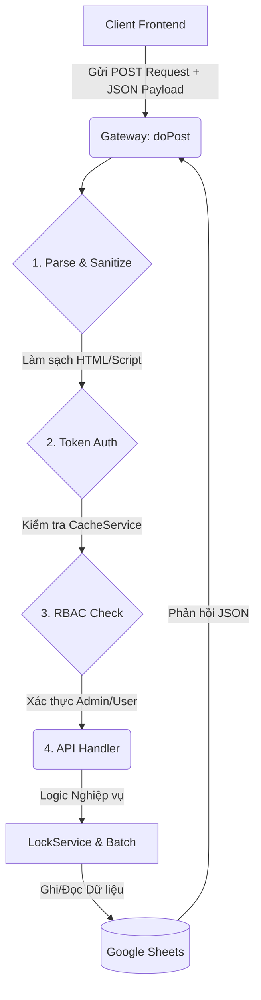

# SYSTEM MASTER DOCUMENTATION
**Dự án:** WebApp Quản Lý Chỉ Tiêu Mở Tài Khoản - Quỹ TDND Yên Thọ  
**Phiên bản:** v3.5 (Nâng cao Bảo mật & Tối ưu hóa)  
**Kiến trúc:** Google Apps Script (Backend) + HTML/JS/CSS (Frontend)

---

## 1. KIẾN TRÚC & SƠ ĐỒ LUỒNG DỮ LIỆU (DATA FLOW)

Toàn bộ hệ thống hoạt động theo kiến trúc luồng đơn (Single-endpoint Architecture), mọi Request từ Client đều đi qua một `Gateway` trung tâm tại `Main.gs` trước khi rẽ nhánh vào các Handlers.



**Các lớp bảo vệ (Defense in Depth):**
1. **Sanitization:** Đệ quy cắt bỏ thẻ `<tag>` trên toàn bộ cấu trúc Payload (trừ Base64/Hash).
2. **Token Auth:** Token (thời hạn 6h) sinh bằng UUID lưu tại `CacheService` thay vì gửi plain email.
3. **RBAC (Role-Based Access Control):** Chặn các action yêu cầu đặc quyền (`Admin`) ngay tại cửa ngõ.
4. **LockService:** Chống xung đột ghi (Race-Condition) khi nhiều cán bộ thao tác đồng thời.
5. **Audit Logging:** Theo dõi và ghi vết toàn bộ thao tác thay đổi dữ liệu xuống sheet `Audit_Log`.

---

## 2. DANH SÁCH API (HANDLERS)

| Tên Action | Quyền Hạn | File Xử Lý | Mục Đích |
| :--- | :---: | :--- | :--- |
| `api_login` | Khách | `api_auth.gs` | Đăng nhập, cấp Token (Kèm Rate Limiting 5 lần/15 phút). |
| `api_changepassword` | User/Admin | `api_auth.gs` | Đổi mật khẩu tài khoản. |
| `api_submitaccount` | User/Admin | `api_account.gs` | Thêm hồ sơ khách hàng mới (Upload ảnh + Ghi Sheet). |
| `api_updatecustomer` | User/Admin | `api_account.gs` | Cập nhật hồ sơ (Có kiểm tra IDOR: chỉ sửa hồ sơ của mình). |
| `api_validateduplicate`| User/Admin | `api_account.gs` | Kiểm tra trùng Số tài khoản, CCCD, Số điện thoại. |
| `api_getmycustomers` | User/Admin | `api_account.gs` | Lấy danh sách hồ sơ do cán bộ đang login thực hiện. |
| `api_getrecentprofiles`| User/Admin | `api_profile.gs` | Lấy lịch sử 5 lần in/xuất PDF hồ sơ gần nhất. |
| `api_getmyranking` | User/Admin | `api_admin.gs` | Xem thứ hạng tổng số lượng hồ sơ hiện tại. |
| `api_gettemplates` | User/Admin | `api_profile.gs` | Lấy danh sách các biểu mẫu PDF cấu hình. |
| `api_generateprofilepdf`| User/Admin | `api_profile.gs` | Ghép dữ liệu Khách hàng vào file Docs/Sheets ra file PDF. |
| `api_exportdrafttopdf` | User/Admin | `api_profile.gs` | Xuất bản thảo PDF sang PDF chính thức và ghi Audit Log. |
| `api_uploadscanprofile`| User/Admin | `api_profile.gs` | Tải lên file PDF Scan đã ký (Bản cứng). |
| **`api_adminupdatestatus`** | **Admin** | `api_admin.gs` | Đổi trạng thái Kích hoạt của một hồ sơ. |
| **`api_savetemplates`** | **Admin** | `api_profile.gs` | Cập nhật file biểu mẫu (Thêm/Sửa/Xóa cấu hình). |
| **`api_getadmindashboarddata`**| **Admin** | `api_admin.gs` | Lấy dữ liệu tổng quan cho biểu đồ Dashboard. |
| **`api_getpageddata`** | **Admin** | `api_admin.gs` | Phân trang (Pagination) danh sách hồ sơ toàn hệ thống. |

---

## 3. HƯỚNG DẪN KHẮC PHỤC SỰ CỐ (TROUBLESHOOTING)

### 3.1 Dữ liệu không cập nhật ngay (Lỗi Cache)
- **Triệu chứng:** Thêm/Sửa thông tin xong, load lại trang vẫn thấy dữ liệu cũ.
- **Nguyên nhân:** Lớp `ScriptCache` (lưu trong 2 tiếng) chưa được clear. Mặc dù hệ thống có gọi `clearCache(sheetName)` sau khi Ghi dữ liệu, nhưng đôi khi Google chậm đồng bộ.
- **Cách khắc phục nhanh:**
  - *Trên code:* Tìm hàm `clearCache(CONFIG.SHEET_DATA)` ở file `Database.gs`, đảm bảo nó đang chạy không bị lỗi.
  - *Thủ công:* Thêm param `?refresh=1` hoặc đổi version cache key trong cấu hình.
  - *Quản trị:* Admin chỉ cần bấm "Làm mới Dashboard" hệ thống có thể ép làm mới bộ nhớ In-Memory.

### 3.2 Khách bị khóa tài khoản do Brute-Force
- **Triệu chứng:** Nhân viên báo "Tài khoản bị khóa tạm thời do nhập sai quá nhiều lần".
- **Nguyên nhân:** Nhân viên nhập sai mật khẩu quá 5 lần trong vòng 15 phút. Hệ thống tự động ghi key `LOGIN_LOCK_{email}` vào `CacheService`.
- **Cách khắc phục:**
  1. Yêu cầu nhân viên chờ đủ 15 phút, hệ thống tự động gỡ khóa.
  2. (Dành cho Dev): Tạo một script ngắn chạy thủ công trên Apps Script để xóa key:
     ```javascript
     function unlockUser() {
       var cache = CacheService.getScriptCache();
       cache.remove('LOGIN_FAIL_email@domain.com');
       cache.remove('LOGIN_LOCK_email@domain.com');
     }
     ```

### 3.3 Không xuất được PDF Hồ Sơ
- **Triệu chứng:** Quay vòng lâu hoặc báo lỗi "Không tìm thấy file mẫu".
- **Nguyên nhân:** ID Thư mục lưu PDF (`CONFIG.PDF_FOLDER_ID`) bị sai, hoặc File Template ID bị xóa/thu hồi quyền truy cập.
- **Cách khắc phục:**
  - Kiểm tra lại các link ID thư mục trong file `Config.gs`.
  - Mở tài khoản thực thi Script (Tài khoản sở hữu Script), đảm bảo tài khoản này CÓ QUYỀN EDITOR đối với File Mẫu và Thư mục chứa.

### 3.4 Lỗi Exceeding Execution Time (Vượt quá 6 Phút)
- **Triệu chứng:** Request thất bại với lỗi `Script execution timed out`.
- **Nguyên nhân:** Thường xảy ra trong tác vụ Dashboard phân trang khi Sheet `Data_MoTaiKhoan` quá lớn (vài nghìn dòng) và đọc thẳng không qua cache.
- **Cách khắc phục:**
  - Luôn đảm bảo Cache Layer đang hoạt động.
  - Sử dụng hàm Server-Side Pagination (`api_getPagedData`) để trích xuất từng phần thay vì đẩy nguyên mảng JSON khổng lồ xuống Frontend.

---
*(Tài liệu này được tạo tự động bởi AI Architect của dự án. Lưu trữ cẩn thận để bàn giao cho các thế hệ lập trình viên tiếp theo duy trì dự án Quỹ Yên Thọ).*
